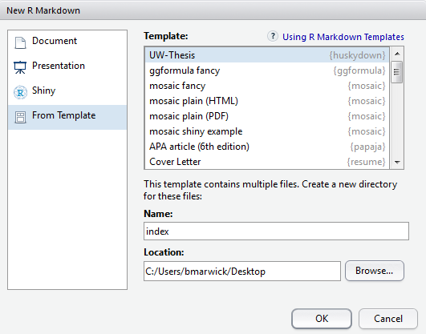

 

# huskydown 

[](https://travis-ci.org/benmarwick/huskydown)

This project provides a template for writing a PhD thesis in R Markdown, and rendering those files into a PDF formatted according to [the requiremnts of the University of Washington](https://grad.uw.edu/for-students-and-post-docs/thesisdissertation/final-submission-of-your-thesisdissertation/). It uses the [University of Washington Thesis class](http://staff.washington.edu/fox/tex/) to convert R Markdown files into a PDF formatted ready for submission at UW. This project was inspired by the [thesisdown](https://github.com/ismayc/thesisdown) and [bookdown](https://github.com/rstudio/bookdown) packages.

Currently, the PDF and gitbook versions are fully-functional. The word and epub versions are developmental, have no templates behind them, and are essentially calls to the appropriate functions in bookdown.

If you are new to working with `bookdown` and `rmarkdown`, please read over the documentation available in huskydown [PDF template](inst/index/_book/thesis.pdf) and the [bookdown book](https://bookdown.org/yihui/bookdown/).

Under the hood, the [University of Washington Thesis LaTeX template](https://github.com/UWIT-IAM/UWThesis) is used to ensure that documents conform precisely to submission standards. At the same time, composition and formatting can be done using lightweight [markdown](http://rmarkdown.rstudio.com/authoring_basics.html) syntax, and **R** code and its output can be seamlessly included using [rmarkdown](http://rmarkdown.rstudio.com).

## Using huskydown to write your PhD thesis

Using **huskydown** has some prerequisites which are described below. To compile PDF documents using **R**, you need to have LaTeX installed. It can be downloaded for Windows at <http://http://miktex.org/download> and for Mac at <http://tug.org/mactex/mactex-download.html>.  Follow the instructions to install the necessary packages after downloading the (somewhat large) installer files. You may need to install a few extra LaTeX packages on your first attempt to knit as well.

We use some fonts, EB Garamond, Source Code Pro and Lato, that all are freely available online if you don't have them already. You should install these before proceeding. 

To use **huskydown** from RStudio:

1) Assuming you have already installed LaTeX and the fonts described above, install the latest version of [RStudio](http://www.rstudio.com/products/rstudio/download/). You can use huskydown without RStudio. For example, you can write the Rmd files in your favourite text editor (e.g. [Atom](https://atom.io/), [Notepad++](https://notepad-plus-plus.org/)). But RStudio is probably the easiest tool for writing both R code and text in your thesis. 

2) Install the **bookdown** and **huskydown** packages: 

```
if (!require("devtools")) install.packages("devtools", repos = "http://cran.rstudio.org")
devtools::install_github("rstudio/bookdown")
devtools::install_github("benmarwick/huskydown")
```

3) Use the **New R Markdown** dialog to select **Thesis**, here are the steps, and a screenshot below:

File -> New File -> R Markdown... then choose 'From template', then choose 'UW-Thesis, and enter `index` as the **Name**. Note that this will currently only **Knit** if you name the directory `index` at this step. 



Or if you're not using RStudio, run this line to create a new PhD thesis from the template:

```r
rmarkdown::draft('index.Rmd', template = 'thesis', package = 'huskydown', create_dir = TRUE)
```


4) Edit the individual chapter R Markdown files to write your thesis.

## Rendering

To render your thesis, open `index.Rmd` in RStudio and then hit the
"knit" button. To change the output formats between PDF, gitbook and Word ,
look at the `output:` field in `index.Rmd`and comment-out the formats 
you don't want.

Alternatively, if you're not using RStudio, you can use this from the R console:

```r
bookdown::render_book('index.Rmd', huskydown::thesis_pdf(latex_engine = 'xelatex'))
```

Your thesis will be deposited in the `_book/` directory.

## Components

The following components are ones you should edit to customize your thesis:

### `_bookdown.yml`

This is the main configuration file for your thesis. Arrange the order of your
chapters in this file and ensure that the names match the names in your folders. 
### `index.Rmd`

This file contains all the meta information that goes at the beginning of your
document. You'll need to edit this to put your name in, the title of your thesis, etc.

### `01-chap1.Rmd`, etc.

These are the Rmd files for each chapter in your dissertation. Write your thesis in these. If you're writing in RStudio, you may find the [wordcount addin](https://github.com/benmarwick/wordcountaddin) useful for getting word counts and readability statistics in R markdown documents. 

### `bib/`

Store your bibliography (as bibtex files) here. We recommend using the [citr addin](https://github.com/crsh/citr) and [Zotero](https://www.zotero.org/) to 
efficiently manage and insert citations. 

### `csl/`

Specific style files for bibliographies should be stored here. A good source for
citation styles is https://github.com/citation-style-language/styles#readme

### `figure/` and `data/`

Store your figures and data here and reference them in your R Markdown files. 

## Related projects

This project has drawn directly on code and ideas in the following:

- https://github.com/UWIT-IAM/UWThesis    
- https://github.com/stevenpollack/ucbthesis  
- https://github.com/suchow/Dissertate    
- https://github.com/SeungkiKwak/Kwak_S_PhD_thesis    
- https://github.com/dhalperi/uwthesis-tweaked     

Other relevant projects:

- Ed Berry's blog post ['Writing your thesis with bookdown'](https://eddjberry.netlify.com/post/writing-your-thesis-with-bookdown/), Posted on September 25, 2017    
- [thesisdowndss](https://github.com/mine-cetinkaya-rundel/thesisdowndss) by Mine Cetinkaya-Rundel at Duke University    
- [beaverdown](https://github.com/zkamvar/beaverdown) by Zhian Kamvar at Oregon State University

## Contributing

If you would like to contribute to this project, please start by reading our [Guide to Contributing](CONTRIBUTING.md). Please note that this project is released with a [Contributor Code of Conduct](CONDUCT.md). By participating in this project you agree to abide by its terms.

<!--
To update the PDF template stored in inst/ assuming we are at top level:

rmarkdown::draft('inst/index.Rmd', template = 'thesis', package = 'huskydown', create_dir = TRUE, edit = FALSE)

setwd('inst/index')

bookdown::render_book('index.Rmd', huskydown::thesis_pdf(latex_engine = 'xelatex'))

-->

